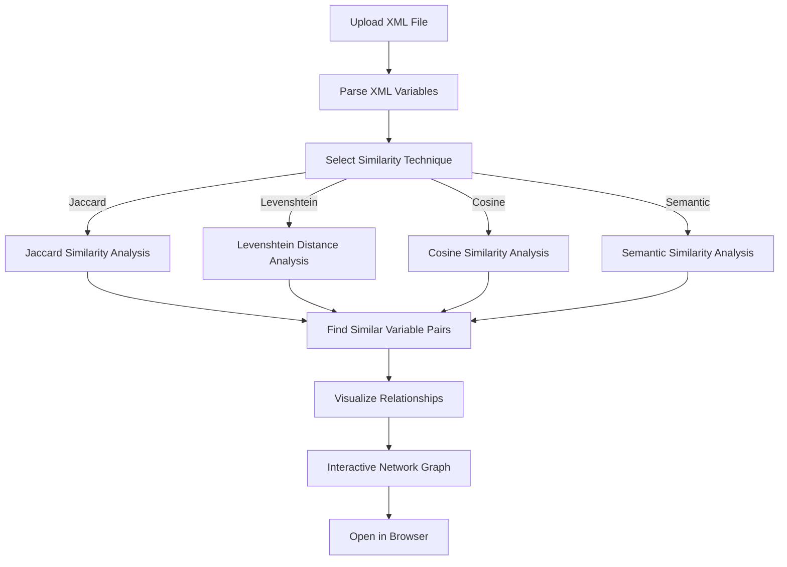

# XML Variable Extractor and Relationship Network Illustrator (XMLVERNIv1)

**Developed by Partha Pratim Ray**  
[GitHub](https://github.com/ParthaPRay) | Contact: [parthapratimray1986@gmail.com](mailto:parthapratimray1986@gmail.com)

---

## Overview

**XMLVERNIv1** is a powerful tool designed to:
1. **Extract variables** from XML files.
2. **Analyze relationships** between variables using various similarity measures.
3. **Visualize interactive networks** of variable relationships for better insights.

This software offers **intuitive processing** and **state-of-the-art similarity techniques** to illustrate the underlying relationships within XML data.

---

## Key Features

- **Variable Extraction**: Parse and extract variables from any XML file.
- **Similarity Measures**:
  - Jaccard Similarity
  - Levenshtein Distance
  - Cosine Similarity
  - Semantic Similarity (using `SentenceTransformer`)
- **Interactive Visualization**: Generates interactive, community-aware relationship networks using `pyvis`.
- **User-Friendly Interface**: Simple UI powered by **Gradio** for seamless interaction.

---

## How It Works



---

## Technical Specifications

### Input
- **XML File**: Upload or use the default `example.xml`.

### Processing Techniques
- **Jaccard Similarity**: Measures the overlap between character sets of two strings.
- **Levenshtein Distance**: Calculates the minimum number of edits required to transform one string into another.
- **Cosine Similarity**: Uses TF-IDF vectorization for character-based similarity.
- **Semantic Similarity**: Leverages `SentenceTransformer` for contextual embedding-based similarity.

### Output
- **Textual Results**: Lists of extracted variables and similar pairs.
- **Interactive Visualization**: Relationship networks with node clustering.

---

## Installation and Setup

1. Clone the repository:
   ```bash
   git clone https://github.com/ParthaPRay/XMLVERNIv1.git
   cd XMLVERNIv1
   ```
2. Install dependencies:
   ```bash
   pip install -r requirements.txt
   ```
3. Run the application:
   ```bash
   python app.py
   ```

---

## Licensing

XMLVERNIv1 is available under **commercial license**. Unauthorized use, reproduction, or distribution is strictly prohibited and punishable under applicable laws.  

# XML Variable Extractor and Relationship Network Illustrator License Agreement

**License Name**: XMLVERNIv1 Commercial Use License  
**Version**: 1.0  
**Effective Date**: January 1, 2024  

**Copyright © 2024 Partha Pratim Ray. All rights reserved.**  

---

## 1. **Grant of License**
This license grants you the non-exclusive, non-transferable, and revocable right to use the software **XML Variable Extractor and Relationship Network Illustrator** ("the Software") in accordance with the terms and conditions outlined below.  

---

## 2. **Permitted Uses**
1. You are allowed to use the Software for personal and commercial purposes.  
2. You may distribute the Software only as a part of your work, provided you obtain prior written consent from the copyright owner, Partha Pratim Ray.  

---

## 3. **Prohibited Uses**
1. You may not distribute, sublicense, or resell the Software or any part thereof without explicit written permission from the copyright owner.  
2. Modifying or reverse-engineering the Software is strictly prohibited.  
3. Unauthorized use or distribution of the Software is considered a violation of this license and applicable laws.

---

## 4. **Attribution**
You must provide clear and conspicuous attribution to the original author, Partha Pratim Ray, in all instances where the Software or its outputs are used.

---

## 5. **Commercial License**
For any organization or individual intending to use the Software for commercial purposes, a valid commercial license must be purchased from the copyright owner. Contact: **parthapratimray1986@gmail.com**.  

---

## 6. **Warranty Disclaimer**
THE SOFTWARE IS PROVIDED "AS IS" WITHOUT WARRANTY OF ANY KIND. THE COPYRIGHT OWNER DISCLAIMS ALL WARRANTIES, INCLUDING BUT NOT LIMITED TO MERCHANTABILITY, FITNESS FOR A PARTICULAR PURPOSE, AND NON-INFRINGEMENT.  

---

## 7. **Limitation of Liability**
In no event shall the copyright owner be liable for any damages (including but not limited to loss of profits, data, or business opportunities) arising out of the use or inability to use the Software.

---

## 8. **Termination**
This license will terminate automatically if you fail to comply with its terms. Upon termination, you must cease all use of the Software and destroy all copies in your possession.  

---

**For licensing inquiries or to purchase a commercial license, contact:**  
**Partha Pratim Ray**  
**Email:** [parthapratimray1986@gmail.com](mailto:parthapratimray1986@gmail.com)  

---


**For licensing inquiries, contact**: [parthapratimray1986@gmail.com](mailto:parthapratimray1986@gmail.com)

---

## Demo

Try the intuitive interface:  
1. Upload your XML file or use the provided default.
2. Select a similarity technique.
3. Adjust parameters via the slider.
4. Submit and view the results with an interactive network visualization.

---

## Contact

For queries, feature requests, or support:  
**Email**: [parthapratimray1986@gmail.com](mailto:parthapratimray1986@gmail.com)  
**GitHub**: [https://github.com/ParthaPRay](https://github.com/ParthaPRay)

---

Make data relationships visible and intuitive with **XMLVERNIv1**!  
Invest in cutting-edge XML analytics for your projects today!

