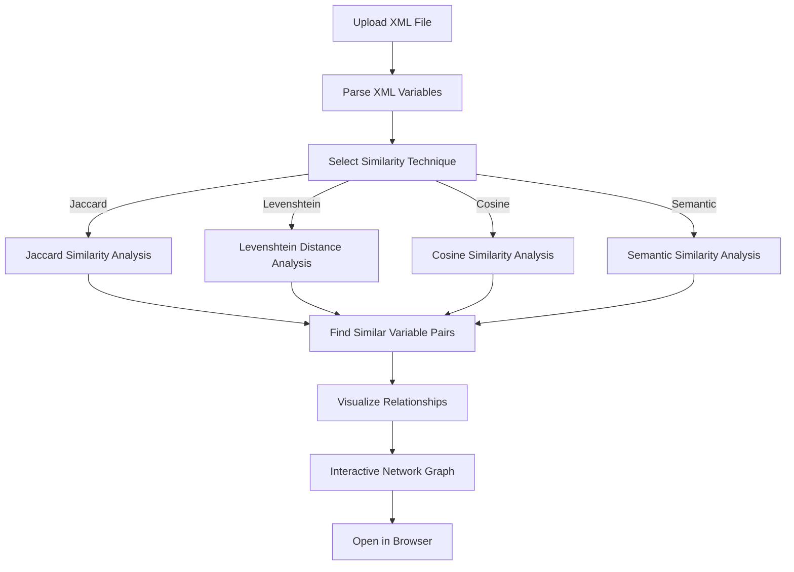

# XML Variable Extractor and Relationship Network Illustrator (XMLVERNIv1)

**Developed by Partha Pratim Ray**  
[GitHub](https://github.com/ParthaPRay) | Contact: [parthapratimray1986@gmail.com](mailto:parthapratimray1986@gmail.com)

---

## Overview

**XMLVERNIv1** is a powerful tool designed to:
1. **Extract variables** from XML files.
2. **Analyze relationships** between variables using various similarity measures.
3. **Visualize interactive networks** of variable relationships for better insights.

This software offers **intuitive processing** and **state-of-the-art similarity techniques** to illustrate the underlying relationships within XML data.

---

## Key Features

- **Variable Extraction**: Parse and extract variables from any XML file.
- **Similarity Measures**:
  - Jaccard Similarity
  - Levenshtein Distance
  - Cosine Similarity
  - Semantic Similarity (using `SentenceTransformer`)
- **Interactive Visualization**: Generates interactive, community-aware relationship networks using `pyvis`.
- **User-Friendly Interface**: Simple UI powered by **Gradio** for seamless interaction.

---

## How It Works



---

## Technical Specifications

### Input
- **XML File**: Upload or use the default `example.xml`.

### Processing Techniques
- **Jaccard Similarity**: Measures the overlap between character sets of two strings.
- **Levenshtein Distance**: Calculates the minimum number of edits required to transform one string into another.
- **Cosine Similarity**: Uses TF-IDF vectorization for character-based similarity.
- **Semantic Similarity**: Leverages `SentenceTransformer` for contextual embedding-based similarity.

### Output
- **Textual Results**: Lists of extracted variables and similar pairs.
- **Interactive Visualization**: Relationship networks with node clustering.

---

## Installation and Setup

1. Clone the repository:
   ```bash
   git clone https://github.com/ParthaPRay/XMLVERNIv1.git
   cd XMLVERNIv1
   ```
2. Install dependencies:
   ```bash
   pip install -r requirements.txt
   ```
3. Run the application:
   ```bash
   python app.py
   ```

---

## Licensing

XMLVERNIv1 is available under **commercial license**. Unauthorized use, reproduction, or distribution is strictly prohibited and punishable under applicable laws.  

**For licensing inquiries, contact**: [parthapratimray1986@gmail.com](mailto:parthapratimray1986@gmail.com)

---

## Demo

Try the intuitive interface:  
1. Upload your XML file or use the provided default.
2. Select a similarity technique.
3. Adjust parameters via the slider.
4. Submit and view the results with an interactive network visualization.

---

## Contact

For queries, feature requests, or support:  
**Email**: [parthapratimray1986@gmail.com](mailto:parthapratimray1986@gmail.com)  
**GitHub**: [https://github.com/ParthaPRay](https://github.com/ParthaPRay)

---

Make data relationships visible and intuitive with **XMLVERNIv1**!  
Invest in cutting-edge XML analytics for your projects today!
